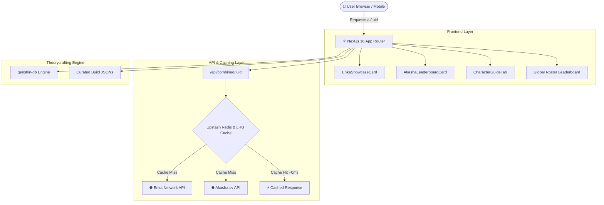
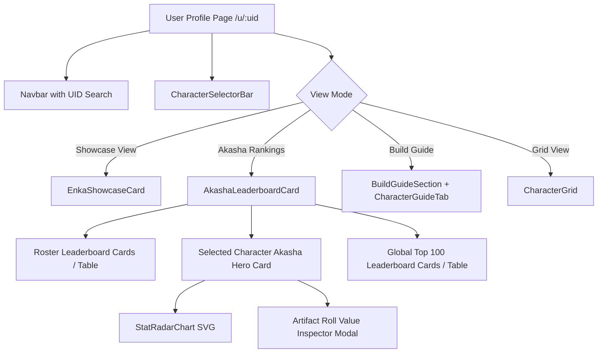

# 🌌 Astralis — Genshin Impact Showcase & Akasha Theorycraft Engine

<div align="center">


**A state-of-the-art Genshin Impact Showcase, Akasha.cv Global Leaderboard Explorer, and Theorycrafting Dashboard built with Next.js 16 and React 19.**

[Features](#-key-features) • [Architecture](#-architecture) • [Tech Stack](#-tech-stack) • [Getting Started](#-getting-started) • [API Routes](#-api-routes)

</div>

---

## ✨ Key Features

| Feature | Description |
|:---|:---|
| 👤 **Real-Time Enka Showcase** | Live in-game player showcase parsing with real-time character builds, weapon refinements, and 5-slot artifact rolls. |
| 🏆 **Akasha System Leaderboards** | Global Top 100 character rankings, server region tags (`NA`, `ASIA`, `CN`, `EU`), live percentile calculation, and calculation models. |
| 🔍 **Universal Character Explorer** | Search and inspect leaderboard builds across all 100+ Genshin Impact characters with element filter chips (`Pyro`, `Hydro`, `Anemo`, etc.). |
| 📊 **Interactive Stat Radar Graph** | SVG-powered spider chart plotting 7 core combat metrics (HP, ATK, DEF, EM, ER%, Crit Rate, Crit DMG). |
| 💎 **Artifact Roll & RV% Inspector** | Full Roll Value (RV%) calculation, Crit Value (CV) tier rating, and tap-to-inspect substat roll count dots (`••••`). |
| 📱 **Mobile-First Responsive UI** | One-tap toggle between **Cards View** and **Table View** for leaderboards, touch-friendly sheets, and smooth momentum scrolling. |
| ⚡ **Dual-Layer Zero-Latency Cache** | In-memory LRU cache + Upstash serverless Redis edge layer for sub-millisecond repeat queries. |

---

## 🏛 Architecture



---

## 🛠 Tech Stack

| Layer | Technology | Purpose |
|:---|:---|:---|
| **Framework** | **Next.js 16** (App Router, Turbopack) | Server Components, dynamic routing, edge API routes |
| **UI Library** | **React 19** | Async transitions, hooks, responsive state |
| **Styling** | **Tailwind CSS v4** | Modern theme tokens, glassmorphism, responsive grid |
| **Language** | **TypeScript 5** | End-to-end type safety, Zod schema validation |
| **Data Fetching** | **SWR** | Stale-while-revalidate client cache & revalidation |
| **Caching** | **Upstash Redis** + In-Memory Map | Dual-layer edge caching with 60s TTL |
| **Game Data** | **genshin-db** | Comprehensive offline Genshin Impact data source |

---

## 📁 Project Structure

```
astralis-genshin/
├── src/
│   ├── app/
│   │   ├── api/
│   │   │   ├── showcase/[uid]/route.ts      # Enka.Network proxy + normalization
│   │   │   ├── ranking/[uid]/route.ts       # Akasha.cv ranking proxy
│   │   │   └── combined/[uid]/route.ts      # Parallel fetch (showcase + ranking)
│   │   ├── u/[uid]/
│   │   │   └── page.tsx                     # User profile dashboard (Showcase, Akasha, Guides, Grid)
│   │   ├── globals.css                      # Design system tokens & glassmorphism
│   │   ├── layout.tsx                       # Root layout & metadata
│   │   └── page.tsx                         # Landing search page
│   ├── components/
│   │   ├── AkashaLeaderboardCard.tsx        # Global roster leaderboard, Top 100 builds & inspector
│   │   ├── EnkaShowcaseCard.tsx             # 3-column live showcase character card
│   │   ├── CharacterSelectorBar.tsx         # Horizontal avatar carousel selector
│   │   ├── CharacterGuideTab.tsx            # Auto-generated theorycrafting guide tab
│   │   ├── BuildGuideSection.tsx            # Curated build guides container
│   │   ├── CharacterGrid.tsx                # Responsive full roster grid
│   │   └── Navbar.tsx                       # Navigation bar with quick UID search
│   ├── data/
│   │   └── builds/                          # Hand-crafted character build guides
│   └── lib/
│       ├── akasha.ts                        # Akasha.cv API client & ranking parser
│       ├── enka.ts                          # Enka.Network API client & asset resolver
│       ├── cache.ts                         # Dual-layer Redis + Memory cache
│       ├── guides.ts                        # Theorycrafting engine (genshin-db)
│       └── types.ts                         # TypeScript data interfaces
├── package.json
└── tsconfig.json
```

---

## 🚀 Getting Started

### Prerequisites

- **Node.js** 18.17+ or 20+
- **npm**, **pnpm**, or **yarn**

### Installation

```bash
# 1. Clone the repository
git clone https://github.com/yasuo72/Genshin_tracker.git
cd Genshin_tracker

# 2. Install dependencies
npm install

# 3. (Optional) Configure environment variables
cp .env.local.example .env.local

# 4. Start development server
npm run dev
```

Open [http://localhost:3000](http://localhost:3000) in your browser.

### Environment Variables (Optional)

```env
# .env.local
ENKA_USER_AGENT=AstralisGenshin/1.0

# Optional: Upstash Redis for production caching
UPSTASH_REDIS_REST_URL=https://your-upstash-redis-url.upstash.io
UPSTASH_REDIS_REST_TOKEN=your-upstash-redis-token
```

---

## 📡 API Routes

| Endpoint | Method | Description |
|:---|:---:|:---|
| `/api/showcase/[uid]` | `GET` | Fetches & normalizes Enka.Network character showcase data |
| `/api/ranking/[uid]` | `GET` | Fetches Akasha.cv leaderboard rankings for showcase characters |
| `/api/combined/[uid]` | `GET` | Parallel fetch executing both showcase and ranking with caching |

---

## 🧩 Component Hierarchy



---

## 📜 License

Distributed under the MIT License. See `LICENSE` for more information.

---

<div align="center">

**Built with ❤️ for Genshin Impact players worldwide.**

</div>
